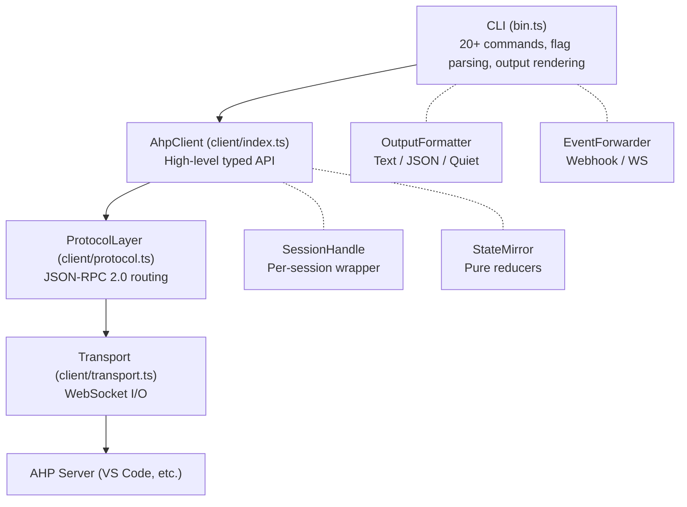

# ahpx

> Connect to AHP servers. Manage AI agent sessions. Stream responses. Dispatch fleets.


---

## What is ahpx?

The [Agent Host Protocol (AHP)](https://github.com/anthropics/agent-host-protocol) is a WebSocket-based JSON-RPC protocol for managing AI agent sessions. It defines how clients create sessions, send prompts, stream model responses, handle tool calls, and manage permissions — all over a persistent, bidirectional connection.

**ahpx** is the first full-featured AHP client. It ships as a single npm package that is both a **CLI for humans** and an **SDK for automation**:

- **CLI** — connect to servers, manage sessions, prompt agents, watch activity, browse files, and check fleet health from your terminal
- **Library** — `import { AhpClient } from '@tylerl0706/ahpx'` for programmatic control of connections, sessions, prompts, event forwarding, and fleet routing

Built by George's engineering team as the dispatch backbone for an autonomous CTO bot, ahpx has shipped 12 phases of development — from basic protocol handling to production-grade fleet management, session persistence, and event streaming.

## Quick Start

Three steps to your first AI agent interaction:

### 1. Start an AHP Server

Launch VS Code with the AHP agent host enabled:

```bash
# Start VS Code as an AHP server on port 8080
./scripts/code-server.sh --agent-host-port 8080 --without-connection-token
```

### 2. Connect

```bash
# Save the server profile
ahpx server add local --url ws://localhost:8080 --default

# Verify connectivity
ahpx connect local
```

### 3. Send a Prompt

```bash
# One-shot execution (creates temp session, prompts, disposes)
ahpx exec --approve-all "What can you do?"

# Or start a persistent session for multi-turn conversations
ahpx session new
ahpx "What can you do?"
```

> **Tip:** Use `ahpx exec` for quick one-off queries. Use `ahpx session new` + `ahpx <prompt>` for multi-turn conversations where the agent remembers context.

## CLI Reference

The ahpx CLI provides 20+ commands organized into logical groups. Every command listed here is the exact interface from the source code.

### Server Management

Save, list, remove, and health-check AHP server connections.

#### `ahpx server add <name> --url <url>`

Save a named connection profile.

| Option | Description |
|--------|-------------|
| `--url <url>` | WebSocket URL (ws:// or wss://) — **required** |
| `--token <token>` | Authentication token |
| `--default` | Set as the default server |
| `--tag <tag>` | Add a tag to this server (repeatable) |

#### `ahpx server list`

List all saved connections.

#### `ahpx server remove <name>`

Remove a saved connection.

#### `ahpx server test <target>`

Test connectivity to a server.

| Option | Description |
|--------|-------------|
| `-t, --timeout <ms>` | Connection timeout in milliseconds (default: 10000) |

#### `ahpx server status`

Health check all saved servers.

| Option | Description |
|--------|-------------|
| `--all` | Show all servers including unreachable |
| `-t, --timeout <ms>` | Health check timeout (default: 10000) |

#### `ahpx server health <name>`

Detailed health check for one server.

| Option | Description |
|--------|-------------|
| `-t, --timeout <ms>` | Health check timeout (default: 10000) |

```bash
# Example: add two servers with tags, check fleet status
ahpx server add local --url ws://localhost:8080 --default --tag dev
ahpx server add cloud --url wss://cloud.example.com:8082 --tag gpu --tag cloud
ahpx server status --all

# Output:
# Name    URL                               Status     Latency  Sessions  Agents
# local   ws://localhost:8080               healthy    12ms     2         copilot
# cloud   wss://cloud.example.com:8082      healthy    45ms     0         copilot
```

### Session Management

Create, list, inspect, close, resume, and export agent sessions.

#### `ahpx session new`

Create a new agent session.

| Option | Description |
|--------|-------------|
| `-s, --server <name>` | Server name or WebSocket URL |
| `-p, --provider <provider>` | Agent provider (e.g. copilot) |
| `-m, --model <model>` | Model to use |
| `-n, --name <name>` | Name this session (for scoped lookups) |
| `--cwd <dir>` | Working directory (default: current dir) |
| `-t, --timeout <ms>` | Connection timeout (default: 10000) |

#### `ahpx session list`

List sessions (default: active only).

| Option | Description |
|--------|-------------|
| `-s, --server <name>` | Filter by server name |
| `-a, --all` | Include closed sessions |

#### `ahpx session show [id]`

Show session details.

| Option | Description |
|--------|-------------|
| `-n, --name <name>` | Session name (for scoped lookup) |
| `-s, --server <name>` | Server name |

#### `ahpx session close [id]`

Close a session (soft-close: keeps record for history).

| Option | Description |
|--------|-------------|
| `-n, --name <name>` | Session name |
| `-s, --server <name>` | Server name |
| `-t, --timeout <ms>` | Connection timeout (default: 10000) |

#### `ahpx session history [id]`

Show turn history for a session.

| Option | Description |
|--------|-------------|
| `-n, --name <name>` | Session name |
| `-s, --server <name>` | Server name |
| `-l, --limit <n>` | Maximum turns to show (default: 10) |
| `--local` | Show only locally-cached turn history (no server connection) |
| `-t, --timeout <ms>` | Connection timeout (default: 10000) |

#### `ahpx session active`

Show all active sessions on the server (live query).

| Option | Description |
|--------|-------------|
| `-s, --server <name>` | Server name or WebSocket URL |
| `-t, --timeout <ms>` | Connection timeout (default: 10000) |

#### `ahpx session export <id>`

Export session record (with turn history) to JSON.

| Option | Description |
|--------|-------------|
| `-o, --output <file>` | Write to file instead of stdout |

#### `ahpx session import <file>`

Import a session record from JSON.

```bash
# Multi-turn workflow with named sessions
ahpx session new --name my-project --provider copilot
ahpx "Explain the architecture of this codebase" -n my-project
ahpx "Now refactor the auth module" -n my-project

# Export for debugging or sharing
ahpx session export abc123 -o session-debug.json

# View turn history
ahpx session history abc123 --limit 20
```

### Prompting

#### `ahpx <text>`

Send a prompt (implicit — any text that isn't a command).

| Option | Description |
|--------|-------------|
| `-s, --server <name>` | Server name or WebSocket URL |
| `-n, --session-name <name>` | Session name (for scoped lookup) |
| `-f, --file <path>` | Read prompt from file (`-` for stdin) |
| `--cwd <dir>` | Working directory |
| `--approve-all` | Auto-approve all permissions |
| `--approve-reads` | Auto-approve reads, prompt for others |
| `--deny-all` | Auto-deny all permissions |

#### `ahpx prompt <text...>`

Explicit prompt command.

| Option | Description |
|--------|-------------|
| `-s, --server <name>` | Server name or WebSocket URL |
| `-n, --session-name <name>` | Session name |
| `-f, --file <path>` | Read prompt from file (`-` for stdin) |
| `--cwd <dir>` | Working directory for auto-created sessions |
| `--approve-all` | Auto-approve all permissions |
| `--approve-reads` | Auto-approve reads, prompt for others |
| `--deny-all` | Auto-deny all permissions |
| `--idle-timeout <seconds>` | Cancel if no events received within N seconds |
| `--tag <key=value>` | Add metadata tags to JSON events (repeatable) |
| `--forward-webhook <url>` | POST events to webhook URL (repeatable) |
| `--forward-ws <url>` | Stream events over WebSocket (repeatable) |
| `--forward-filter <types>` | Comma-separated event types to forward |
| `--forward-headers <json>` | Custom headers for forwarders (JSON object) |

#### `ahpx exec <text...>`

One-shot: create temp session, prompt, dispose.

| Option | Description |
|--------|-------------|
| `-s, --server <name>` | Server name or WebSocket URL |
| `-p, --provider <provider>` | Agent provider |
| `-m, --model <model>` | Model to use |
| `--cwd <dir>` | Working directory for the session |
| `--approve-all` | Auto-approve all permissions |
| `--approve-reads` | Auto-approve reads, prompt for others |
| `--deny-all` | Auto-deny all permissions |
| `--idle-timeout <seconds>` | Cancel if no events within N seconds |
| `--tag <key=value>` | Add metadata tags (repeatable) |
| `--forward-webhook <url>` | POST events to webhook URL (repeatable) |
| `--forward-ws <url>` | Stream events over WebSocket (repeatable) |
| `--forward-filter <types>` | Comma-separated event types to forward |
| `--forward-headers <json>` | Custom headers for forwarders (JSON object) |

#### `ahpx cancel`

Cancel the active turn in a session.

| Option | Description |
|--------|-------------|
| `-n, --session-name <name>` | Session name |
| `-s, --server <name>` | Server name |

```bash
# One-shot with JSON output (for automation)
ahpx exec -s local --format json --json-strict --approve-all \
  "Fix the failing test in src/auth.test.ts"

# Read prompt from file
ahpx prompt -f instructions.md --approve-reads

# Pipe prompt from stdin
echo "Explain this error" | ahpx prompt -f -
```

### Observation & Browsing

#### `ahpx watch [id]`

Attach to a session as observer and stream all activity.

| Option | Description |
|--------|-------------|
| `-n, --session-name <name>` | Session name |
| `-s, --server <name>` | Server name |

#### `ahpx browse [directory]`

Browse server filesystem.

| Option | Description |
|--------|-------------|
| `-s, --server <name>` | Server name |

#### `ahpx content <uri>`

Fetch content by URI from the server.

| Option | Description |
|--------|-------------|
| `-s, --server <name>` | Server name |
| `-o, --output <file>` | Write content to file instead of stdout |

#### `ahpx model <model-id>`

Switch the model for a session.

| Option | Description |
|--------|-------------|
| `-n, --session-name <name>` | Session name |
| `-s, --server <name>` | Server name |

#### `ahpx agents`

List available agents and models on the server.

| Option | Description |
|--------|-------------|
| `-s, --server <name>` | Server name |

#### `ahpx connect [target]`

Connect to an AHP server and print server info.

| Option | Description |
|--------|-------------|
| `-t, --timeout <ms>` | Connection timeout (default: 10000) |

### Configuration

#### `ahpx config show`

Print resolved config with source annotations.

#### `ahpx config init`

Create `~/.ahpx/config.json` with defaults.

#### `ahpx completions bash|zsh|fish`

Generate shell completion scripts.

Configuration is layered (later wins):

1. **Defaults** — `permissions: "approve-reads"`, `timeout: 30`, `format: "text"`
2. **Global** — `~/.ahpx/config.json`
3. **Project** — `.ahpxrc.json` in current directory or git root
4. **CLI flags** — highest priority

```bash
# Initialize global config
ahpx config init

# See resolved configuration and where each value comes from
ahpx config show
# permissions: approve-reads (default)
# format: json (project: .ahpxrc.json)
# defaultServer: local (global: ~/.ahpx/config.json)
```

### Global Options

These flags apply to all commands:

| Flag | Description | Default |
|------|-------------|---------|
| `--format <format>` | Output format: `text`, `json`, or `quiet` | `text` |
| `--json-strict` | Suppress non-JSON stderr output (use with `--format json`) | off |
| `-v, --verbose` | Enable debug logging to stderr | off |
| `--version` | Print version and exit | |
| `--help` | Show help for any command | |

## Library SDK Reference

`import { AhpClient, SessionHandle, ConnectionPool } from '@tylerl0706/ahpx'` — the same protocol engine that powers the CLI, available as a fully-typed TypeScript API.

### Connect and List Agents

```typescript
import { AhpClient } from '@tylerl0706/ahpx';

const client = new AhpClient();
const info = await client.connect('ws://localhost:8080');

console.log('Protocol version:', info.protocolVersion);
console.log('Agents:', client.state.root.agents);

// Each agent has a provider name and list of models
for (const agent of client.state.root.agents) {
  console.log(`  ${agent.provider}: ${agent.models.join(', ')}`);
}

await client.disconnect();
```

### Sessions and Prompts with SessionHandle

```typescript
import { AhpClient, SessionHandle } from '@tylerl0706/ahpx';

const client = new AhpClient();
await client.connect('ws://localhost:8080');

// Open a session — returns a SessionHandle
const session = await client.openSession({
  provider: 'copilot',
  workingDirectory: '/my/project',
});

// Wait for the session to reach idle state
await session.waitForReady();

// Listen for real-time events
session.on('action', (envelope) => {
  console.log('Action:', envelope.action.type);
});

// Send a prompt and await the full turn result
const result = await session.sendPrompt('Explain this codebase', {
  permissions: 'approve-reads',
});

console.log(result.responseText);   // Full model response
console.log(result.toolCalls);       // Number of tool calls made
console.log(result.state);           // "complete" | "cancelled" | "error"

// Multi-turn: send another prompt in the same session
const result2 = await session.sendPrompt('Now refactor the auth module');

// Clean up
session.dispose();
await client.disconnect();
```

The `TurnResult` returned by `sendPrompt()`:

```typescript
interface TurnResult {
  turnId: string;           // UUID for this turn
  responseText: string;     // Full model response
  toolCalls: number;        // How many tool calls were made
  usage?: IUsageInfo;       // { inputTokens, outputTokens, model? }
  state: "complete" | "cancelled" | "error";
  error?: string;           // Error message if state is "error"
}
```

### Multi-Session on One Connection

```typescript
// Open multiple sessions on a single WebSocket connection
const session1 = await client.openSession({ provider: 'copilot' });
const session2 = await client.openSession({ provider: 'copilot' });

// Each SessionHandle filters events by its session URI
// — no cross-talk between sessions
const [r1, r2] = await Promise.all([
  session1.sendPrompt('Write unit tests'),
  session2.sendPrompt('Fix the linting errors'),
]);

session1.dispose();
session2.dispose();
```

### ConnectionPool for URL-Keyed Reuse

```typescript
import { ConnectionPool } from '@tylerl0706/ahpx';

const pool = new ConnectionPool();

// getClient() returns an existing client for the URL, or creates a new one
const client1 = await pool.getClient('ws://localhost:8080');
const client2 = await pool.getClient('ws://localhost:8080');  // Same client!
const client3 = await pool.getClient('wss://cloud:8082');       // Different server

console.log(pool.size); // 2

// Disconnect all pooled connections
await pool.closeAll();
```

### Fleet Management

```typescript
import { FleetManager, HealthChecker } from '@tylerl0706/ahpx';

// Health-check individual servers
const checker = new HealthChecker();
const health = await checker.check('ws://localhost:8080', 'local');
console.log(health.status);         // "healthy" | "degraded" | "unreachable"
console.log(health.latencyMs);       // 12
console.log(health.activeSessions);  // 2

// Fleet-level routing with strategies
const fleet = new FleetManager({
  connections: [
    { name: 'local', url: 'ws://localhost:8080', tags: ['dev'] },
    { name: 'cloud', url: 'wss://cloud:8082', tags: ['gpu', 'prod'] },
  ],
  strategy: 'least-sessions',  // or 'round-robin', 'random', 'preferred'
});

// Select the best server matching requirements
const server = await fleet.selectServer({
  tag: 'gpu',
  provider: 'copilot',
});
console.log(server.name, server.url);  // "cloud", "wss://cloud:8082"
```

### Event Forwarding

```typescript
import {
  WebhookForwarder,
  WebSocketForwarder,
  ForwardingFormatter,
} from '@tylerl0706/ahpx';

// Webhook: batched HTTP POST with retry
const webhook = new WebhookForwarder({
  url: 'https://dashboard.example.com/events',
  batchSize: 10,
  batchIntervalMs: 1000,
  retries: 3,
  filter: ['turn_complete', 'tool_call_complete'],
});

// WebSocket: real-time streaming with backpressure
const ws = new WebSocketForwarder({
  url: 'ws://monitor:9090/events',
  filter: ['delta', 'turn_complete'],
});

// Decorate any OutputFormatter to also forward events
const formatter = new ForwardingFormatter({
  inner: myOutputFormatter,
  forwarders: [webhook, ws],
  tags: { jobId: 'abc-123' },
});

// Events are forwarded fire-and-forget — errors never propagate
// to the inner formatter or turn controller
```

### Session Persistence

```typescript
import { SessionStore, SessionPersistence } from '@tylerl0706/ahpx';

const store = new SessionStore();      // ~/.ahpx/sessions/
const persistence = new SessionPersistence(store);

// Resume a session from a previous run
const record = store.get('session-id-abc');
const outcome = await persistence.resume(record, client);

if (outcome.status === 'resumed') {
  console.log('Session resumed successfully');
} else if (outcome.status === 'not_found') {
  console.log('Session was disposed on server — creating new one');
}

// Save a turn result for local history
await persistence.saveTurn(record.id, {
  ...turnResult,
  userMessage: 'Fix the auth bug',
});

// Sync local records with server state
const sync = await persistence.sync(client, 'local');
console.log(`Added: ${sync.added.length}, Removed: ${sync.removed.length}`);
```

### Authentication

```typescript
import { AuthHandler } from '@tylerl0706/ahpx';

const auth = new AuthHandler({
  token: process.env.AHPX_TOKEN,  // Or from CLI flag, file, interactive
});

// Token resolution order:
// 1. --token CLI flag
// 2. $AHPX_TOKEN environment variable
// 3. ~/.ahpx/auth.json stored token
// 4. Interactive prompt (if TTY)
```

### Full Export List

Everything available from `import { ... } from '@tylerl0706/ahpx'`:

| Category | Exports |
|----------|---------|
| Core Client | `AhpClient`, `AhpClientOptions`, `AhpClientEvents`, `OpenSessionOptions` |
| Session Handle | `SessionHandle`, `SessionHandleEvents`, `PromptOptions`, `SessionTurnResult` |
| Connection Pool | `ConnectionPool`, `ConnectionPoolOptions` |
| Transport | `Transport`, `TransportOptions` |
| Protocol Layer | `ProtocolLayer`, `ProtocolLayerOptions`, `RpcError`, `RpcTimeoutError` |
| State Mirror | `StateMirror` |
| Reconnection | `ReconnectManager`, `ReconnectOptions`, `ReconnectOutcome` |
| Event Forwarding | `EventForwarder`, `AhpxEvent`, `WebhookForwarder`, `WebSocketForwarder`, `ForwardingFormatter` |
| Fleet Management | `FleetManager`, `FleetManagerOptions`, `RoutingStrategy`, `ServerRequirements`, `HealthChecker`, `ServerHealth` |
| Session Persistence | `SessionStore`, `SessionPersistence`, `SessionRecord`, `TurnSummary`, `ResumeOutcome`, `SyncResult` |
| Auth | `AuthHandler`, `AuthHandlerOptions` |
| Config | `ConnectionProfile` |
| Protocol Types | `IRootState`, `ISessionState`, `IActiveTurn`, `ITurn`, `IToolCallState`, `ActionType`, `IActionEnvelope`, and more |

## Output Formats

Control how ahpx renders output with `--format`:

### `--format text` (default)

Human-readable colored terminal output with labeled sections:

```
$ ahpx exec --approve-all "List the files in src/"

[tool] listDirectory src/
[tool ✓] Found 12 files

Here are the files in the src/ directory:
- bin.ts — CLI entry point
- index.ts — Library exports
- errors.ts — Error classes
...

[done] 1 tool call · 342 input tokens · 128 output tokens
```

### `--format json`

NDJSON (newline-delimited JSON) — one event per line, perfect for machine consumption:

```json
{"type":"delta","timestamp":"2026-03-21T16:00:00.000Z","data":{"content":"Hello"}}
{"type":"delta","timestamp":"2026-03-21T16:00:00.001Z","data":{"content":"! How"}}
{"type":"delta","timestamp":"2026-03-21T16:00:00.002Z","data":{"content":" can I help?"}}
{"type":"usage","timestamp":"2026-03-21T16:00:00.100Z","data":{"usage":{"inputTokens":42,"outputTokens":8}}}
{"type":"turn_complete","timestamp":"2026-03-21T16:00:00.101Z","data":{"responseText":"Hello! How can I help?"}}
```

> **NDJSON Event Types:** `delta`, `reasoning`, `tool_call_start`, `tool_call_delta`, `tool_call_ready`, `tool_call_complete`, `tool_call_cancelled`, `permission`, `usage`, `turn_complete`, `turn_error`, `turn_cancelled`, `title_changed`

### `--format quiet`

Silent accumulation — prints only the final response text with no decoration:

```
$ ahpx exec --format quiet --approve-all "What is 2+2?"

2+2 equals 4.
```

> **Tip:** Use `--format json --json-strict` together for fully machine-readable output with no stderr noise — ideal for piping into `jq` or parsing in automation scripts.

## Permission Modes

Control how ahpx handles tool confirmation and permission requests:

| Flag | Reads | Writes | Shell | Tools |
|------|-------|--------|-------|-------|
| `--approve-all` | ✅ Auto-yes | ✅ Auto-yes | ✅ Auto-yes | ✅ Auto-yes |
| `--approve-reads` | ✅ Auto-yes | ⚠️ Prompt | ⚠️ Prompt | ⚠️ Prompt |
| `--deny-all` | ❌ Auto-no | ❌ Auto-no | ❌ Auto-no | ❌ Auto-no |

- **`--approve-all`** — use for automated workflows (CI, bots, batch jobs) where the agent is trusted
- **`--approve-reads`** — default; allows file reads automatically but prompts for writes and shell commands
- **`--deny-all`** — for read-only sessions where the agent should only generate text

```bash
# Automated dispatch — trust the agent completely
ahpx exec --approve-all "Fix all lint errors and commit"

# Interactive — approve writes manually
ahpx "Refactor the auth module" --approve-reads

# Read-only — no tools allowed
ahpx exec --deny-all "Explain this architecture"
```

## Fleet Management

Manage multiple AHP servers as a fleet with health monitoring, server tagging, and intelligent routing strategies.

### Server Tags

Tag servers for logical grouping:

```bash
ahpx server add local --url ws://localhost:8080 --tag dev --tag fast
ahpx server add gpu-1 --url wss://gpu1.example.com:8082 --tag gpu --tag prod
ahpx server add gpu-2 --url wss://gpu2.example.com:8082 --tag gpu --tag prod
```

### Health Checking

```bash
# Check all servers
ahpx server status

# Name    URL                               Status     Latency  Sessions  Agents
# local   ws://localhost:8080               healthy    12ms     2         copilot
# gpu-1   wss://gpu1.example.com:8082       healthy    45ms     0         copilot
# gpu-2   wss://gpu2.example.com:8082       healthy    38ms     1         copilot

# Detailed health for one server
ahpx server health gpu-1
```

### Routing Strategies

The `FleetManager` SDK supports four routing strategies:

| Strategy | Behavior |
|----------|----------|
| `least-sessions` | Pick the server with fewest active sessions (default) |
| `round-robin` | Cycle through healthy servers in order |
| `random` | Random selection from healthy candidates |
| `preferred` | Use preferred server if healthy, fallback to least-sessions |

```typescript
const fleet = new FleetManager({
  connections: savedProfiles,
  strategy: 'least-sessions',
  tags: { gpu: ['gpu-1', 'gpu-2'] },
});

// Route to a GPU server with the fewest active sessions
const target = await fleet.selectServer({ tag: 'gpu' });

// Refresh health data
await fleet.refresh();
const allHealth = await fleet.getHealth();
```

## Event Forwarding

Stream ahpx events to external consumers — dashboards, log aggregators, monitoring systems — via webhook or WebSocket.

### Webhook Forwarding

Batched HTTP POST with retry and filtering:

```bash
# Forward turn_complete events to a webhook
ahpx exec --approve-all \
  --forward-webhook https://dashboard.example.com/events \
  --forward-filter turn_complete,tool_call_complete \
  "Run all tests"
```

| Option | Default | Description |
|--------|---------|-------------|
| Batch size | 10 | Events per batch before flush |
| Batch interval | 1000ms | Max delay before flushing a partial batch |
| Retries | 3 | Retry attempts with exponential backoff |

### WebSocket Forwarding

Real-time streaming with auto-reconnect and backpressure handling:

```bash
# Stream all events to a WebSocket monitor
ahpx prompt --approve-reads \
  --forward-ws ws://monitor.local:9090/events \
  "Analyze the performance of this service"
```

- **Auto-reconnect** with exponential backoff on disconnect
- **Backpressure** — pauses sending when buffered data exceeds 1 MB
- **Disconnect buffering** — buffers up to 10,000 events while reconnecting

### Multiple Forwarders

```bash
# Send to multiple destinations simultaneously
ahpx exec --approve-all \
  --forward-webhook https://logs.example.com/ingest \
  --forward-ws ws://dashboard:9090/live \
  --forward-filter delta,turn_complete,tool_call_complete \
  --forward-headers '{"Authorization":"Bearer token123"}' \
  "Deploy the staging environment"
```

> **Fire-and-forget:** Forwarder errors are logged but never propagate to the output formatter or turn controller. Your agent session continues unaffected even if a webhook endpoint is down.

## George Integration

ahpx was built as the dispatch backbone for **George** — an autonomous CTO bot that manages engineering teams through AI agents. Here's how George uses ahpx:

### Dispatch Architecture

George's `DispatchRouter` auto-discovers AHP servers and routes agent jobs through ahpx using dynamic V1/V3 routing:

```bash
# George dispatches an agent via ahpx one-shot execution
ahpx exec \
  -s vscode \
  --format json \
  --json-strict \
  --approve-all \
  "Fix the failing test in src/auth.test.ts"
```

### NDJSON Parsing for Job Tracking

George parses the NDJSON stream to track job progress in real-time:

```typescript
// George reads ahpx stdout line-by-line
for (const line of ndjsonLines) {
  const event = JSON.parse(line);
  switch (event.type) {
    case 'delta':              // Streaming model response
    case 'tool_call_complete': // Tool finished
    case 'turn_complete':      // Job done — get full response
    case 'turn_error':         // Job failed
  }
}
```

### The Vision

- **Multi-turn intervention** — George can send follow-up prompts when an agent gets stuck
- **Session persistence** — resume agent sessions across George restarts
- **Real-time observation** — watch agent activity via `ahpx watch`
- **Fleet management** — route jobs to the best available server via `FleetManager`
- **Event streaming** — forward events to dashboards for real-time job monitoring

## Architecture

ahpx is built as a three-layer client with clean separation of concerns. Each layer is independently testable and replaceable.



### Key Design Patterns

| Pattern | Where |
|---------|-------|
| Three-layer composition | Transport → Protocol → AhpClient — each independently testable |
| EventEmitter coupling | Loose coupling between layers via events |
| Pure reducers | Immutable state updates for deterministic testing (`StateMirror`) |
| Strategy pattern | `OutputFormatter` implementations swap rendering behavior |
| Decorator pattern | `ForwardingFormatter` wraps any formatter, forwarding fire-and-forget |
| Directory-walk scoping | Smart session resolution within git boundaries |
| Layered configuration | Default → global → project → CLI with source tracking |
| Connection pooling | URL-keyed reuse prevents redundant WebSocket connections |
| Atomic file writes | Temp file + rename prevents corruption in session store |

### Phases Shipped

| Phase | Name | Status |
|-------|------|--------|
| 0–6 | Foundation (client, connections, sessions, prompting, output, observation, George integration) | ✅ Complete |
| 7 | Library Mode — npm package with typed API | ✅ Complete |
| 8 | Multi-Session — SessionHandle, ConnectionPool | ✅ Complete |
| 9 | Event Forwarding — Webhook + WebSocket streaming | ✅ Complete |
| 10 | Fleet Management — HealthChecker, FleetManager, server tags | ✅ Complete |
| 11 | Robust Multi-Turn — SessionPersistence, turn history, export/import | ✅ Complete |
| 12 | Production Hardening — CI/CD, 485 tests, error docs, npm publish | ✅ Complete |

## Exit Codes

Well-defined exit codes for scripting and CI integration:

| Code | Name | Meaning |
|------|------|---------|
| `0` | Success | Command completed successfully |
| `1` | Error | Runtime error during execution |
| `2` | Usage | Bad CLI arguments or missing required flags |
| `3` | Timeout | Connection or request timed out |
| `4` | NoSession | No active session found — run `session new` first |
| `5` | PermissionDenied | All permission requests were denied |
| `130` | Interrupted | Process interrupted (Ctrl+C / SIGINT) |

```bash
# Use exit codes in scripts
ahpx exec --approve-all "Run the tests"
if [ $? -eq 0 ]; then
  echo "Agent completed successfully"
elif [ $? -eq 3 ]; then
  echo "Timed out — server may be overloaded"
elif [ $? -eq 4 ]; then
  echo "No session — run 'ahpx session new' first"
fi
```

---

*Built by George's engineering team · 485 tests · 12 phases · Quality over everything*

[Agent Host Protocol](https://github.com/anthropics/agent-host-protocol) · ahpx v0.2
